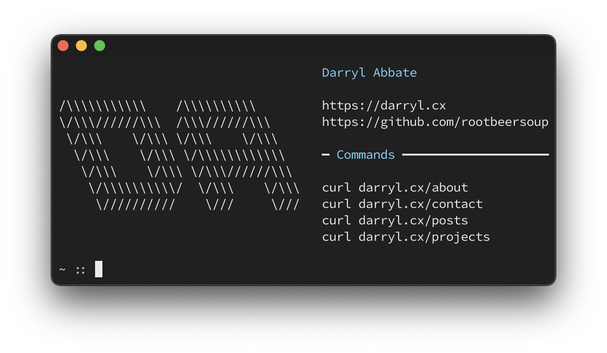

  

This is my personal website, which contains basic information about myself as well as a blog and a place to showcase my projects. 

## Table of Contents
* [Command-Line Minisite](#command-line-minisite)
  * [Available Commands](#available-commands)

---

## Command-Line Minisite
Along with the typical browser view, there is also a minisite which can be accessed from the command-line with `curl`.

  

### Available commands
* `curl darryl.cx` - Seen in the above screenshot.
* `curl darryl.cx/about` - A little about myself.
* `curl darryl.cx/contact` - Contact info.
* `curl darryl.cx/posts` - 5 latest blog posts (⌘ + click opens links in iTerm).
* `curl darryl.cx/pgp` - My public PGP key.
  * `curl darryl.cx/pgp | pbcopy` to copy to macOS clipboard.
  * `curl darryl.cx/pgp | gpg --import` to add the key automatically.
* `curl darryl.cx/projects` - Brief overview of some of my projects.
