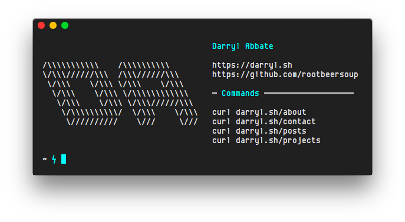

  

This is my personal website, which contains basic information about myself as well as a blog and a place to showcase my projects. 

## Table of Contents
* [Command-Line Minisite](#command-line-minisite)
  * [Available Commands](#available-commands)
  * [Make One Yourself!](#make-one-yourself)

---

## Command-Line Minisite
Along with the typical browser view, there is also a minisite which can be accessed from the command-line with `curl`.

  

### Available commands
* `curl darryl.sh` - Seen in the above screenshot.
* `curl darryl.sh/about` - A little about myself.
* `curl darryl.sh/contact` - Contact info.
* `curl darryl.sh/posts` - 5 latest blog posts (⌘ + click opens links in iTerm).
* `curl darryl.sh/pgp` - My public PGP key.
  * `curl darryl.sh/pgp | pbcopy` to copy to macOS clipboard.
  * `curl darryl.sh/pgp | gpg --import` to add the key automatically.
* `curl darryl.sh/projects` - Brief overview of some of my projects.

### Make One Yourself!
I'll have a blog post soon with a tutorial on how to implement something like this on your own site (using Nginx).

## To-Do
* Flesh out content
* Dark/light theme switcher
