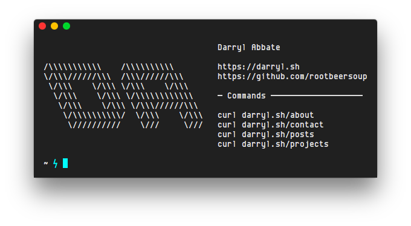

<p align="center" >
  
</p>

This tutorial assumes you have access to your web server's file system, and that it's running [Nginx](https://www.nginx.com) to serve your site. Please note the minisite we're serving is nothing more than plain-text files, which are piped into the shell via [`curl`](https://curl.haxx.se). This is not a tutorial for creating an interactive or [captive](https://flylib.com/books/en/2.506.1.34/1/) CLI; it's simply a trick which redirects curl requests to plain-text files as opposed to a mess of raw HTML.

## Configuring Nginx

A simple way to implement the minisite would be to make a separate directory for all our plain-text files. That way, we can plug this code into our site's Nginx configuration...

```nginx
server {
  if ($http_user_agent ~* curl) { # If a curl request...
    rewrite /$ /txt/index last;   # Redirect / to /txt/index
    rewrite ^/(.*)$ /txt/$1;      # Redirect all other requests to the appropriate pages
  }
}
```
...And all requests coming from `curl` will be redirected to the `/txt/` directory in our website's root. This allows us to create custom plain-text versions of all pages found on the browser-friendly site. Redirecting `/` to a specified index (`/txt/index`) sets a "home page" which will be returned when upon a `curl` request of the base URL.

This piece of code tells Nginx to serve all files as plain-text. This is only necessary if you ever want to view these files in a browser, since Nginx forces the browser to download the files rather than viewing them in the browser window:

```nginx
server {
  location /txt/ {                        # In the /txt/ directory...
    location ~* {                         # For all files in the directory...
      add_header Content-Type text/plain; # Serve as plain-text
    }
  }
}
```

If you want to view your specified plain-text index page in the browser when visiting `example.com/txt`, you can tell Nginx to look for a file named `index` (or whatever you choose) alongside the other default index file names:

```nginx
server {
  index index index.html;
}
```

Here is all that code pieced together:

```nginx
server {
  if ($http_user_agent ~* curl) {
    rewrite /$ /txt/index last;
    rewrite ^(.*)$ /txt/$1;
  }

  index index index.html;

  location /txt/ {
    location ~* {
      add_header Content-Type text/plain;
    }
  }
}
```

Make sure to run `sudo service nginx restart` after saving your configuration.

## Basic Command-Line-Friendly Pages

Here's a basic example of a plain-text page that should render nicely on most terminal windows:

```text

━━━ Contact Info ━━━━━━━━━━━━━━━━━━━━━━━

    Name      John Doe

    Website   https://johndoe.io

    E-mail    john@johndoe.io

```

Notice I added extra lines before and after the block of text. This provides a nicer layout in a terminal window thanks to the breathing room I added. It's perfectly acceptable to add more than one newline to the *top* of your text block, but adding more newlines to the bottom of a text block may force the user to scroll up.

A good convention to follow would be to keep text blocks no wider than 80 characters. Naturally it's a good idea to keep blocks as narrow as possible to avoid line wrapping.

## (Slightly) More Advanced Pages

Colored output will require use of escape sequencing. While it's possible to input escape characters into plain-text files, it's recommended to use code to generate the escape sequences for you. 

In this example, I use a small `.erb` file to generate escape characters with some inline Ruby. The only escape characters used here are the ones which put `Latest Articles` in bold text:

```erb

━━━ <%= "\e[1mLatest Articles\e[0m" %> ━━━━━━━━━━━━━━━━━━━━

<% blog.articles[0...5].each do |article| %>
    <%= article.title %>
    <%= article.data.date %>
    <%= article.data.permalink %>

<% end %>
```

## Troubleshooting

If everything was set up correctly, you should be able to run `curl example.com` and return your plain-text pages without issue. I used Nginx in this tutorial since it worked seamlessly for me. I tried for weeks to get this to work with Apache 2.4, but it simply wouldn't work so long as I had an SSL certificate. Nginx can handle `curl` requests even without prefixing the requests with `https://`.

If you're having trouble getting this to work properly, you may need to check your [regex](https://en.wikipedia.org/wiki/Regular_expression).
